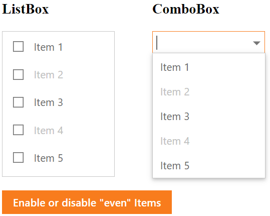

<!-- default badges list -->

[](https://supportcenter.devexpress.com/ticket/details/T1070760)
[](https://docs.devexpress.com/GeneralInformation/403183)
<!-- default badges end -->
# List Box and Combo Box for ASP.NET Web Forms - How to enable or disable items
<!-- run online -->
**[[Run Online]](https://codecentral.devexpress.com/463091094/)**
<!-- run online end -->

This example demonstrates how to use CSS classes to enable or disable items in editors.



## Overview

Create a custom CSS class and set the [pointer-events](https://developer.mozilla.org/en-US/docs/Web/CSS/pointer-events) property to `none`. To assign this CSS class to an item, call an editor's client-side `AddItemCssClass` method.

```css
.disabled {
    pointer-events: none;
    color: silver;
}
```

```js
function enableItems(editor, enable) {
    for (i = 0; i < editor.GetItemCount(); i++) {
        if (editor.GetItem(i).value % 2 == 0)//Your custom codition
            if (enable)
                editor.RemoveItemCssClass(i, 'disabled');//Enable an item
            else
                editor.AddItemCssClass(i, 'disabled'); //Disable an item
    }
}
```

## Files to Look At

* [Default.aspx](./CS/Solution/Default.aspx) (VB: [Default.aspx](./VB/Solution/Default.aspx))
* [Default.aspx.cs](./CS/Solution/Default.aspx.cs) (VB: [Default.aspx.vb](./VB/Solution/Default.aspx.vb))

## Documentation

* [ClientComboBox.AddItemCssClass](https://docs.devexpress.com/AspNet/js-ASPxClientComboBox.AddItemCssClass(index-className))
* [ClientComboBox.RemoveItemCssClass](https://docs.devexpress.com/AspNet/js-ASPxClientComboBox.RemoveItemCssClass(index-className))
* [ClientListBox.AddItemCssClass](https://docs.devexpress.com/AspNet/js-ASPxClientListBox.AddItemCssClass(index-className))
* [ClientListBox.RemoveItemCssClass](https://docs.devexpress.com/AspNet/js-ASPxClientListBox.RemoveItemCssClass(index-className))

## More Examples

* [Combo Box for ASP.NET Web Forms - How to customize an item's appearance](https://github.com/DevExpress-Examples/asp-net-web-forms-combo-box-customize-item-appearance)
